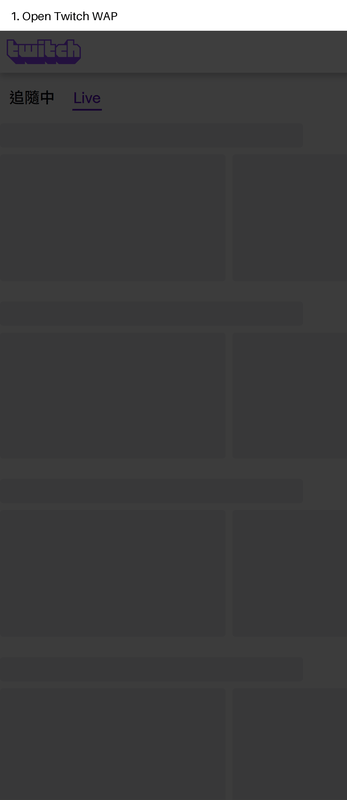

# Twitch WAP Auto Test

以 SDD + DDD + TDD + BDD 建立的 Twitch 行動網頁（WAP）測試框架。完整的需求、架構邊界、驗收準則與工作狀態請見 `SPEC/WAP_AUTOTEST_SPEC.md`。

## Prerequisites

- Python 3.11+
- Google Chrome（已驗證的目標為 Chrome Mobile Emulator - Pixel 7）
- 網路可存取 `https://m.twitch.tv/`

Selenium Manager 會在第一次執行 E2E 時自動解析相容的 ChromeDriver，不需要手動下載 driver。

## Local E2E demo

以下 GIF 由本機 Pixel 7 Chrome mobile-emulation 執行實際 Twitch WAP 流程產生：



## Install

```powershell
python -m venv .venv
.\.venv\Scripts\Activate.ps1
python -m pip install -r requirements.txt
```

## Test commands

```powershell
# 快速、無網路且不啟動瀏覽器的 unit 與 contract tests
pytest -m "not e2e"

# 依序使用 Pixel 7、iPhone 與 Samsung viewport 執行 Twitch WAP BDD/E2E 情境
pytest -m e2e

# 使用三個獨立 Chrome session 平行執行三個 viewport
pytest -m e2e -n 3
```

重新錄製 README GIF：

```powershell
python scripts/record_local_demo.py
```

每次 E2E 執行只建立一個 batch 資料夾，裝置產物分開保留：

```text
artifacts/
  20260818T153727207246Z-1c1dee3a/
    pixel-7/
      channel-metadata-...png
    iphone/
      channel-metadata-...png
    samsung/
      channel-metadata-...png
```

E2E 成功與失敗截圖會寫入該 batch，`artifacts/` 不納入版本控制。失敗時另會建立 JSON 診斷（URL、時間、錯誤與截圖名稱）。Twitch UI 與結果內容會隨時間變動，若 E2E 無法選取結果，請保留產物後更新 SPEC 的定位器決策，再調整 `TwitchWapUi` adapter。

## Architecture

- `domain/`: 通用語言、Channel Readiness 與 Interruption 決策。
- `application/`: 不依賴 Selenium 的 Search Journey orchestration 與 ports。
- `infrastructure/`: Selenium Chrome、Twitch UI 定位器及 Evidence writer。
- `features/` + `tests/bdd/`: 可讀的 Gherkin 行為規格與 step definitions。
- `tests/unit/`、`tests/contract/`: TDD 的快速回饋層；`tests/bdd/` 為 live E2E 層。
